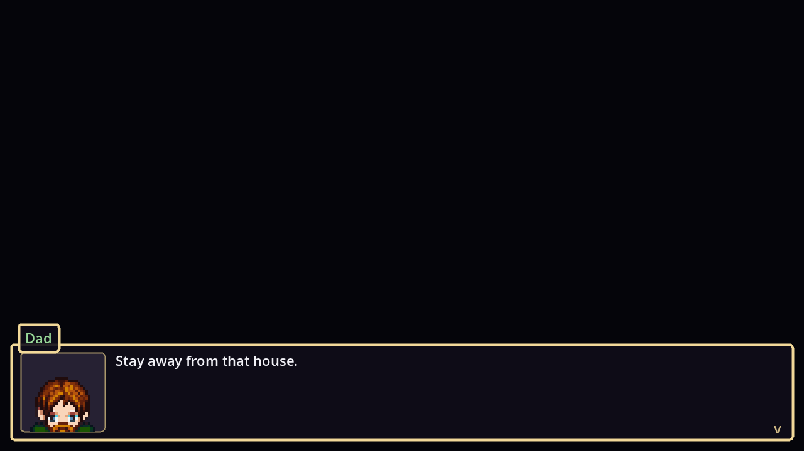
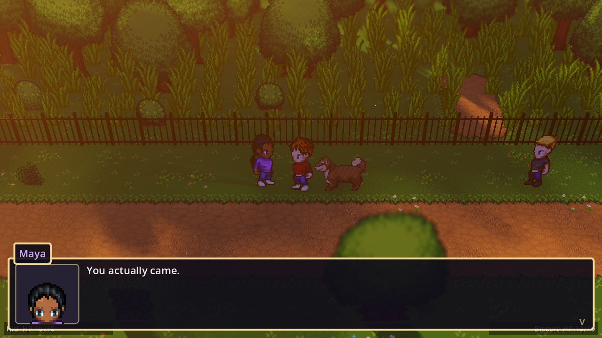
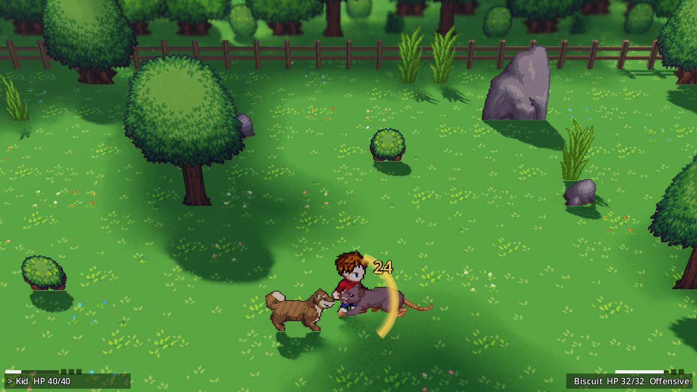
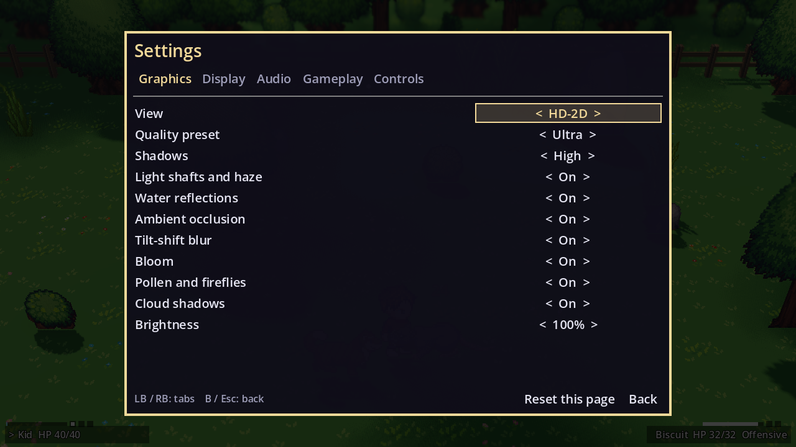
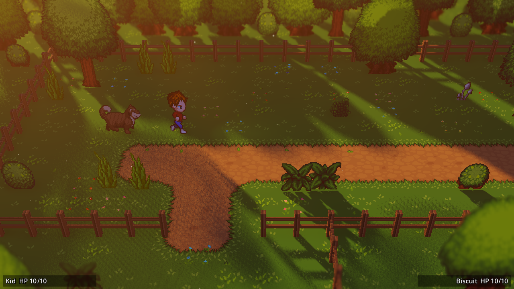
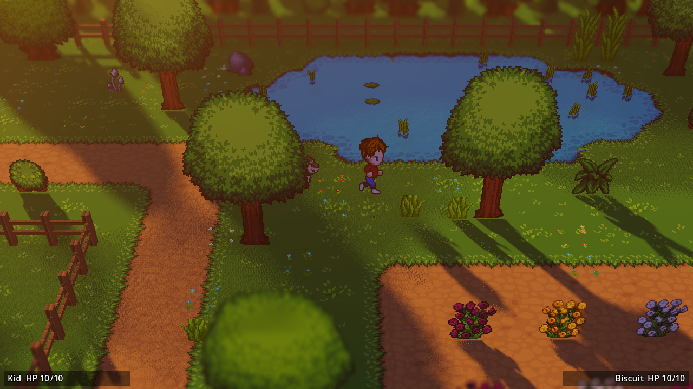
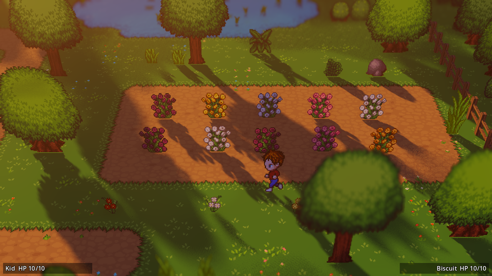
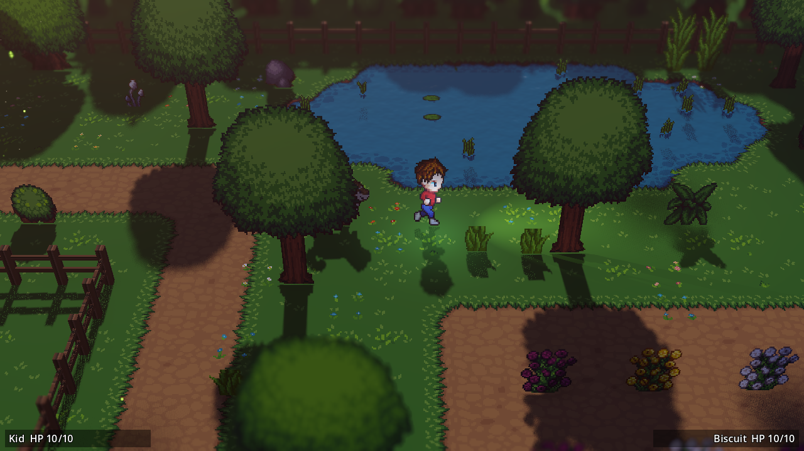
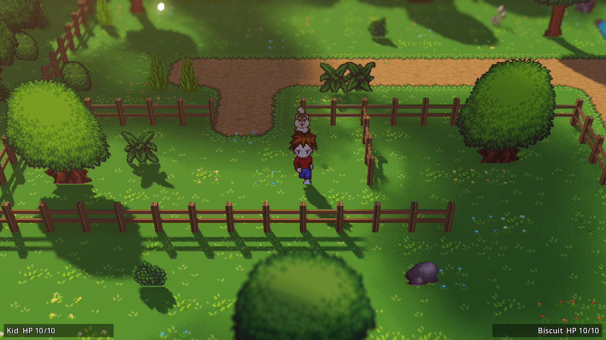
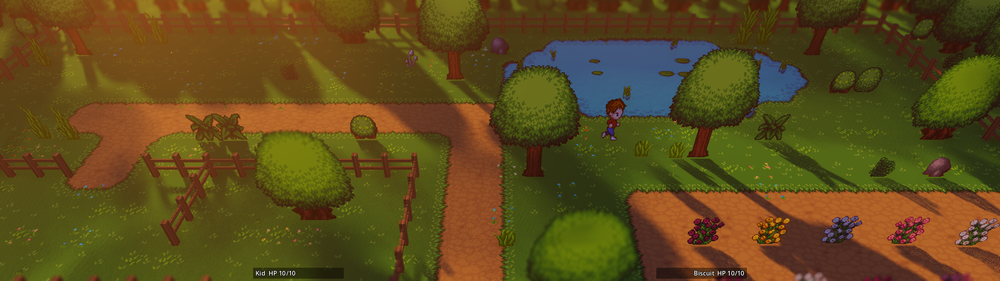

# Secret of Evermore 2: Return to Evermore

A fan sequel to *Secret of Evermore* (Square, 1995): a top-down action RPG
about a kid, his shelter dog, and a world built from dreams. Thirty years after
the original, Professor Ruffleberg's machine wakes up again, and so does Carltron.

It's drawn the way Square Enix remakes its own SNES classics (Octopath
Traveler, Dragon Quest III HD-2D): pixel-art sprites standing in a lit 3D world,
with real sun shadows, light shafts through the trees, tilt-shift blur, a
reflective pond and drifting cloud shadows. It runs pixel-perfect on any
monitor, from a Steam Deck to a 48:9 triple-wide.

> **Early prototype.** The story's opening is playable: dinner with Dad, then
> the dare at the Ruffleberg place, with people to talk to. Combat is in: a
> test arena with giant rats shows the swing and its auto charge, and you can
> switch between the kid and the dog, leave one on Stay put, and set how the
> AI plays the other. It has sound and music now, and a settings menu. See the
> [roadmap](docs/ROADMAP.md) for what's next.

| Dinner with Dad | The dare at the Ruffleberg place |
|---|---|
|  |  |

| Combat: a fully charged swing (x4) on a giant rat | Settings (Esc / Start) |
|---|---|
|  |  |

| Golden hour | Koi pond | Rose garden |
|---|---|---|
|  |  |  |

| Night: flashlight, fireflies, the phone's glow | Day: the fenced pen |
|---|---|
|  |  |

**32:9 super ultrawide:** the yard as a tilt-shift diorama.

---

## Try it

### The tech demo (download and play)

**[Download the tech demo](https://github.com/Er2oneousbit/evermore2/releases/tag/tech-demo)**
for Windows or Linux. No engine needed: unzip and run.

> **The release is only a tech demo of the game mechanics, not the game.** It
> shows the systems as they're built (the HD-2D look, the dog, talking, combat)
> and it's updated in place as they're polished. The story, the realms and the
> real content come later.

Inside: `Evermore2.exe` starts the prologue, `Combat arena.bat` the fight
with the giant rats (also on Hard), `Test yard.bat` the yard where a whole day goes by in 24 minutes (two shops,
one that closes at night). The three are joined by paths: follow the
prologue street's road east to the yard, and the yard's shop street north to
the arena. The
exe isn't code-signed, so Windows may warn you: **More info**, then
**Run anyway**. On Linux use `./Evermore2.x86_64`, `./combat-arena.sh` and
`./test-yard.sh`.

### From source

The newest work runs from source in the free Godot engine.

1. Install **Godot 4.7.x** (the standard build, not .NET) from
   <https://godotengine.org/download>. It's a single file; no installer.
2. Download this repo (**Code → Download ZIP**) and unzip it.
3. Open Godot, click **Import**, and pick the `project.godot` file.
4. Press **F5** to play. The game opens on a **Debug Menu**: pick the map to
   start in (the prologue from the start or from the street, the test yard, the
   combat arena), the time of day and Normal or Hard.

It needs a graphics card with Vulkan or Direct3D 12 for the full look. On an
older computer, start Godot with `--rendering-method gl_compatibility`: it still
runs, without the light shafts, reflections and blur.

## Controls

| Action | Keyboard | Gamepad |
|---|---|---|
| Pause menu and **settings** | Esc | Start |
| Move | WASD / Arrow keys | Left stick |
| Run (hold; drains the attack charge) | Shift | LB |
| Ring menu (equipment, items, alchemy, party) | I | Y |
| Quick slots (use what's in them) | 1 2 3 4 | D-pad |
| In the ring menu: other rings, use, put in a quick slot | Z / X, E, 1-4 | LB / RB, A, D-pad |
| Phone flashlight | F | L3 (click the left stick) |
| Attack (waiting charges it up) | J / Space | A |
| Talk / interact | E / Enter | A |
| Switch between the kid and the dog | Tab | Back / View |
| Partner: Stay put / come back | Q | X |
| Partner's stance (Offensive, Defensive / Search) | R | RB |
| Sniff (driving the dog) | C | B |
| Time of day (prototype) | F2 | |
| Stop the clock / clock speed (prototype) | F7 / F9 | |
| Classic 2D view (prototype) | F6 | |

Every control except the pause button can be rebound in **Settings →
Controls**. Settings also has graphics (quality presets, each effect,
brightness, HD-2D or classic 2D), display (window mode, V-Sync, frame cap),
audio volumes and gameplay options (text speed, screen shake, damage numbers,
hold or toggle to run).

## Found a bug?

Bug reports are welcome: see [CONTRIBUTING.md](CONTRIBUTING.md). This is a
one-person project, so pull requests and feature requests aren't taken.

## Credits

* Art from the **LPC (Liberated Pixel Cup)** library: Eliza Wyatt, Lanea
  Zimmerman, Stephen Challener, Sevarihk, bluecarrot16, JaidynReiman and many
  more. Every artist and license is in [CREDITS.md](CREDITS.md).
* Music by **Juhani Junkala** (SubspaceAudio); sound effects by artisticdude,
  Kenney, qubodup, pauliuw and Fantozzi. All CC0, all credited in
  [CREDITS.md](CREDITS.md).
* Code under the [MIT License](LICENSE). The art keeps its own licenses
  (CC-BY, CC-BY-SA, OGA-BY, GPL; see CREDITS.md).
* Developer notes: [docs/DEVELOPMENT.md](docs/DEVELOPMENT.md).

---

*Secret of Evermore is © Square Enix. This is a non-commercial fan project,
not affiliated with or endorsed by Square Enix. It contains no material from
the original game.*

Written with help from Claude (Anthropic) via Claude Code.

Made with ❤️ from your friendly hacker - er2oneousbit
