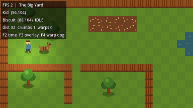
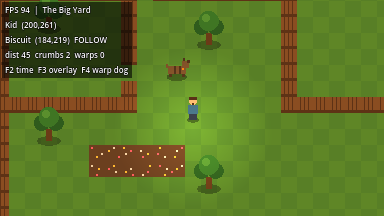
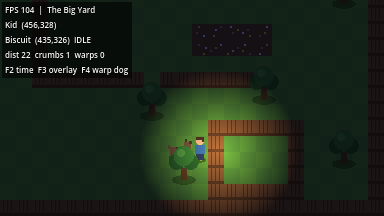

# Secret of Evermore 2: Return to Evermore

A fan sequel to *Secret of Evermore* (Square, 1995). Top-down action RPG,
modern pixel art, built in **Godot 4**.

> **Status: Prototype 0.** A kid walks around a placeholder backyard, the dog
> follows him, and you can flip day/night and the phone flashlight. No combat,
> menus, or story yet. Everything is placeholder shapes drawn in code.

| Golden hour + F3 overlay | Dog following through the fence maze | Night, phone flashlight on |
|---|---|---|
|  |  |  |

---

## Quick start

1. **Install Godot 4.7.x (standard build, not .NET)** from
   <https://godotengine.org/download>. It's a single executable; no installer needed.
2. Clone this repo.
3. Open Godot, click **Import**, pick this folder's `project.godot`.
   (First open takes a few seconds while Godot builds its `.godot/` cache.)
4. Press **F5** (or the ▶ Play button) to run.

### Controls (Prototype 0)

| Action | Keyboard | Gamepad |
|---|---|---|
| Move | WASD / Arrow keys | Left stick / D-pad |
| Toggle phone flashlight | F | Y |
| Dog: stay / follow | E | X |
| Attack (not wired up yet) | J / Space | A |

### Debug keys

| Key | Does |
|---|---|
| F2 | Cycle time of day: day / golden hour / night |
| F3 | Toggle debug overlay (FPS, positions, dog AI state, breadcrumb trail) |
| F4 | Warp the dog to the kid (unstick him) |

---

## Command line options

Godot hands everything after a bare `--` to the game:

```bash
godot --path . -- --help       # list options and quit
godot --path . -- --debug      # start with the F3 overlay on
godot --path . -- --verbose    # extra log lines (AI state changes, spawns, ...)
```

On Windows, `godot` is whatever you named the Godot executable, e.g.
`Godot_v4.7.2-stable_win64.exe`. All log output also goes to
`user://logs/godot.log` (Windows: `%APPDATA%\Godot\app_userdata\<project name>\logs\`).

---

## Tests

```bash
# Headless smoke test: walks the kid through the fenced maze and checks the
# dog keeps up (no stutter, no backtracking, no safety warps).
godot --headless --path . --fixed-fps 60 res://tests/smoke_follow.tscn
# exit code 0 = PASS, 1 = FAIL (reasons printed as [TEST] FAIL lines)

# Same test with screenshots (needs a display; on Linux CI use xvfb-run)
EVERMORE_SHOT_DIR=/tmp/shots godot --path . --fixed-fps 60 res://tests/smoke_follow.tscn
```

On Windows PowerShell, set the variable first: `$env:EVERMORE_SHOT_DIR="C:\temp\shots"`.
Run the test before pushing anything that touches the kid, the dog, or the yard.

---

## Folder map

```
evermore2/
├── project.godot        Engine settings (384x216 pixel-perfect, autoloads)
├── autoload/            Global singletons, loaded before any scene
│   ├── debug.gd           CLI options, logging, F3 overlay
│   ├── input_setup.gd     ALL key/gamepad bindings (one readable table)
│   ├── names.gd           Every proper noun, loaded from data/names.json
│   ├── event_bus.gd       Game-wide signals (light toggled, time changed...)
│   └── game_state.gd      Player-chosen names, current realm, story flags
├── actors/
│   ├── kid/               Player character
│   └── dog/               Companion AI (breadcrumb follow + string pulling)
├── realms/
│   ├── _shared/           Pieces used by many realms (placeholder tree)
│   └── big_yard/          Prototype 0 test map (ASCII layout, throwaway)
├── ui/debug_overlay/    The F3 overlay
├── data/names.json      Character / place / item names (edit names HERE)
├── tests/               Automated smoke tests
└── docs/                Design bible, art spec, architecture notes
```

## Project rules (read before contributing)

1. **No hardcoded names.** Characters, places, and items come from
   `Names.text("key")`, backed by `data/names.json`.
2. **Bindings live in `autoload/input_setup.gd`**, not in Project Settings.
3. **Origins at the feet.** Every actor/prop is drawn upward from (0, 0) so
   Y-sorting works. Put them under a node with `y_sort_enabled = true`.
4. **Game-wide events go through `EventBus`.** Local stuff uses normal signals.
5. **Commit `.import` and `.uid` files.** Never commit `.godot/`.
6. **Tests pass before push.**

## Docs

- [`docs/design-bible.md`](docs/design-bible.md): story, cast, realms, dog forms, mission 1
- [`docs/art-spec.md`](docs/art-spec.md): resolution, palettes, "Modern SNES" rules
- [`docs/architecture.md`](docs/architecture.md): systems overview, dog AI, roadmap

## Recommended tools

| Tool | Why |
|---|---|
| VS Code + **godot-tools** extension | GDScript editing and debugging (the repo suggests it automatically) |
| **Aseprite** (or free: Pixelorama / LibreSprite) | Pixel art and animation |
| Aseprite Wizard (Godot plugin) | Imports Aseprite animations directly |

---

*Secret of Evermore is © Square Enix. This is a non-commercial fan project.*

Written with help from Claude (Anthropic) via Claude Code.

Made with ❤️ from your friendly hacker - er2oneousbit
