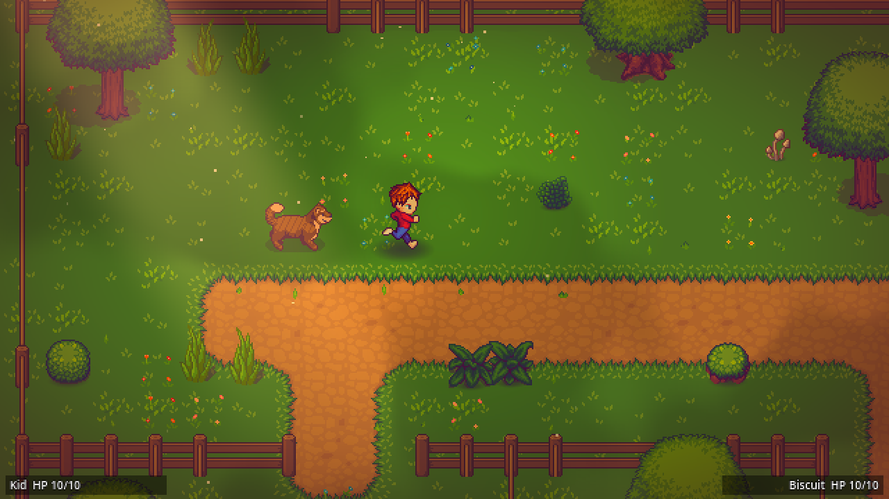
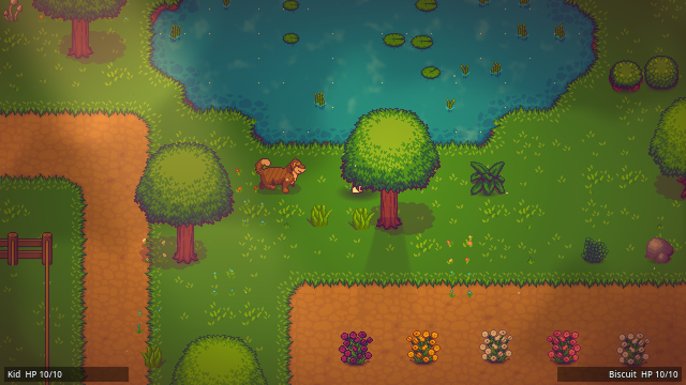
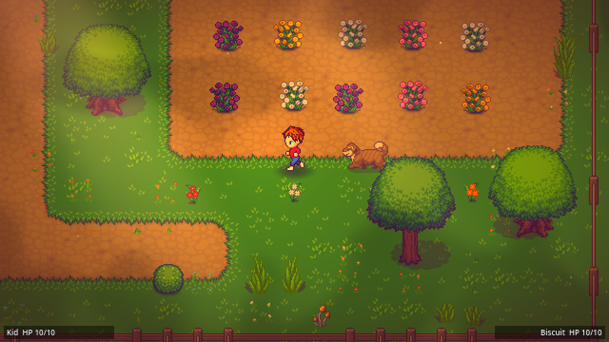
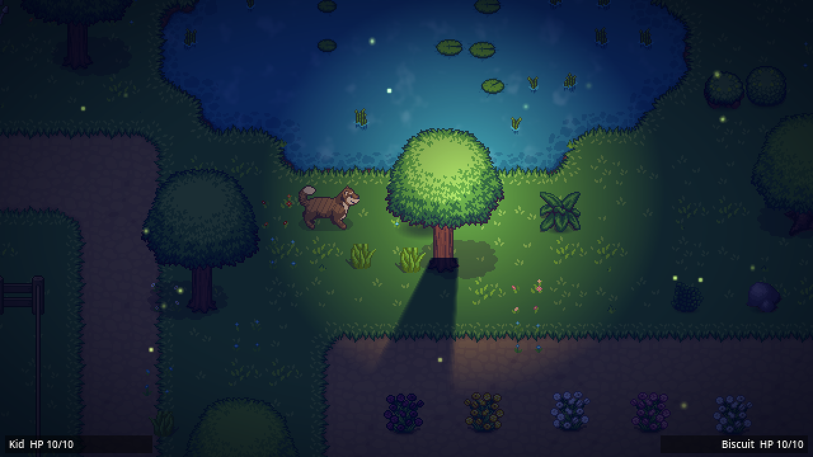
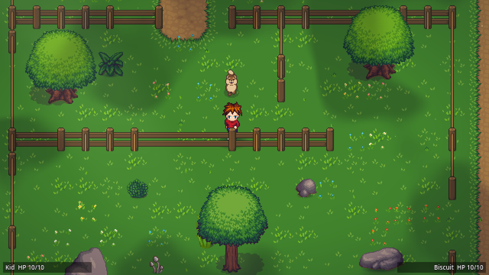
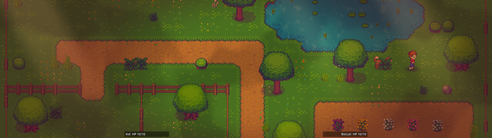
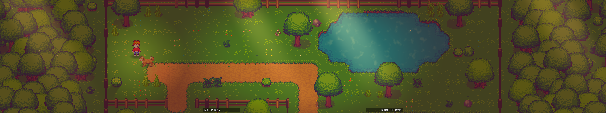

# Secret of Evermore 2: Return to Evermore

A fan sequel to *Secret of Evermore* (Square, 1995). Top-down action RPG,
modern pixel art, built in **Godot 4**.

> **Status: Prototype 0.2, real art.** A kid runs around a backyard built
> from the **LPC Revised** pixel-art library, with his dog following him.
> Day, golden hour and night each have their own lighting, color grade,
> drifting cloud shadows, pollen or fireflies, and a phone flashlight that
> casts real shadows. Pixel-perfect on **any monitor shape: 16:9, 21:9, 32:9,
> 48:9 triple-wide, Steam Deck**. No combat, menus or story yet.

| Golden hour | Koi pond | Rose garden |
|---|---|---|
|  |  |  |

| Night: flashlight with real shadows, fireflies | Day: the fenced pen (dog-follow test course) |
|---|---|
|  |  |

**32:9 super ultrawide (3840x1080):** the whole yard at once, HUD pulled into the middle.


**48:9 triple-wide (7680x1440):** woods beyond the fence fill the extra width.


---

## Quick start

1. **Install Godot 4.7.x (standard build, not .NET)** from
   <https://godotengine.org/download>. It's a single executable; no installer needed.
2. Clone this repo.
3. Open Godot, click **Import**, pick this folder's `project.godot`.
   (First open takes a few seconds while Godot builds its `.godot/` cache.)
4. Press **F5** (or the ▶ Play button) to run.

Older GPU or a VM? Run with `--rendering-method gl_compatibility` (see below).
Everything works in both renderers.

### Controls

| Action | Keyboard | Gamepad |
|---|---|---|
| Move (full tilt = run, partial = walk) | WASD / Arrow keys | Left stick / D-pad |
| Toggle phone flashlight | F | Y |
| Dog: stay / follow | E | X |
| Attack (not wired up yet) | J / Space | A |

### Debug keys

| Key | Does |
|---|---|
| F2 | Cycle time of day: day / golden hour / night |
| F3 | Toggle debug overlay (FPS, view size, positions, dog AI state, breadcrumb trail) |
| F4 | Warp the dog to the kid (unstick him) |

---

## Command line options

Godot hands everything after a bare `--` to the game:

```bash
godot --path . -- --help       # list options and quit
godot --path . -- --debug      # start with the F3 overlay on
godot --path . -- --verbose    # extra log lines (AI state changes, time of day, ...)
godot --path . --rendering-method gl_compatibility   # older GPUs / VMs (a Godot flag, BEFORE the --)
```

On Windows, `godot` is whatever you named the Godot executable, e.g.
`Godot_v4.7.2-stable_win64.exe`. All log output also goes to
`user://logs/godot.log` (Windows: `%APPDATA%\Godot\app_userdata\<project name>\logs\`).

---

## Tests

Run the tests before pushing anything that touches actors, the camera, the
HUD, the yard, or the art plumbing. Exit code 0 = PASS, 1 = FAIL, and
failures print as `[TEST] FAIL` lines that say what went wrong.

```bash
# Everything headless in one go (Windows: pwsh tests/run_all.ps1 -Godot <path to *_console.exe>)
tests/run_all.sh /path/to/godot

# Dog follow AI: walks the kid past the dog and through the fenced pen.
# Fails on stutter, backtracking, falling behind, or safety warps.
godot --headless --path . --fixed-fps 60 res://tests/smoke_follow.tscn

# Art plumbing: LPC animation rows, Atmosphere presets, prop building.
godot --headless --path . --fixed-fps 60 res://tests/smoke_visuals.tscn

# Any-monitor scaling. Headless: the math for 18 real monitors.
godot --headless --path . res://tests/smoke_aspect.tscn
# With a display: also the live window (bars, void, camera, HUD) at that size
godot --path . --resolution 5120x1440 res://tests/smoke_aspect.tscn

# Full monitor matrix, 13 resolutions from Steam Deck to 48:9 triple-wide:
tests/run_aspect_matrix.sh /path/to/godot [screenshot_dir]          # Linux / CI (Xvfb)
pwsh tests/run_aspect_matrix.ps1 -Godot C:\path\to\Godot_v4.7.2-stable_win64_console.exe  # Windows
#   older GPU / VM?  add:  -ExtraArgs "--rendering-method gl_compatibility"

# Screenshot tour: renders fixed viewpoints at each time of day (needs a display).
EVERMORE_SHOT_DIR=/tmp/shots godot --path . --resolution 1280x720 res://tests/screenshot_tour.tscn
```

On Windows PowerShell, set variables first: `$env:EVERMORE_SHOT_DIR="C:\temp\shots"`.
For test output in PowerShell, use the `*_console.exe` Godot build (it ships in the same zip).

---

## Art: where it comes from, how to change it

All art is from the **LPC (Liberated Pixel Cup)** library and friends: free
licenses that need credit (see [`CREDITS.md`](CREDITS.md)). Nothing is drawn
by hand in an image editor; every crop, recolor and composition is a script,
so the art can be rebuilt and the license trail never breaks.

| What | Source | Rebuild with |
|---|---|---|
| The kid | Universal LPC Character Generator (teen body, red longsleeve, jeans) | `node tools/lpc/build_character.js kid <out dir>` |
| The dog | LPC shiba by Sevarihk, recolored into a brown brindle mutt | `python3 tools/art/build_art.py --only dog` |
| Ground tiles + autotile data | LPC Revised summer tileset (JaidynReiman's Tiled build) | `python3 tools/art/build_art.py --only tileset` |
| Trees, bushes, flowers, rocks, pond plants | LPC Revised 4-Season Terrain (Eliza Wyatt et al.) | `python3 tools/art/build_art.py --only props` |

* **Change the kid's outfit:** build him in the
  [web generator](https://liberatedpixelcup.github.io/Universal-LPC-Spritesheet-Character-Generator/),
  copy the part of the URL from `#` on into `tools/lpc/characters.json`, run the
  command above, and copy `sheet.png` / `credits.*` where the JSON says.
  Details: [`tools/lpc/README.md`](tools/lpc/README.md).
* **Add a prop:** add a few lines to `build_props()` in `tools/art/build_art.py`
  (crop box, sway, collision), or make a `PropData` resource by hand in the
  Godot inspector. Then use it from a realm's `PROPS_BY_CHAR`.
* **Redesign the test yard:** edit the ASCII `LAYOUT` in
  `realms/big_yard/prototype_yard.gd`. Shores, path edges, fences, the pond's
  lily pads and reeds all autotile from it.

Art tools need Python 3.9+ with Pillow (`pip install pillow`) and, for the
kid only, Node 18+ with Playwright. **Playing and testing the game needs neither.**

---

## Folder map

```
evermore2/
├── project.godot        Engine settings (640x360 pixel-perfect, autoloads)
├── CREDITS.md           Who made the art, under which license (REQUIRED reading)
├── autoload/            Global singletons, loaded before any scene
│   ├── debug.gd           CLI options, logging, F3 overlay
│   ├── screen_scaler.gd   Crisp integer scaling that fills ANY monitor shape
│   ├── input_setup.gd     ALL key/gamepad bindings (one readable table)
│   ├── names.gd           Every proper noun, loaded from data/names.json
│   ├── event_bus.gd       Game-wide signals (light toggled, time changed...)
│   └── game_state.gd      Player-chosen names, current realm, story flags
├── actors/
│   ├── kid/               Player character (LPC sprite, run/walk, flashlight)
│   └── dog/               Companion AI (breadcrumb follow + string pulling)
├── systems/
│   ├── animation/         DirectionalSprite, LpcSprite (characters), AnimalSprite
│   ├── atmosphere/        Time of day: tint, color grade, clouds, pollen, fireflies
│   └── camera/            GameCamera: map bounds + centering on wide screens
├── realms/
│   ├── _shared/           Prop + PropData, WangAutotiler (used by every realm)
│   └── big_yard/          Test map (ASCII layout -> tiles, fences, props)
├── assets/              Images the game loads
│   ├── characters/        kid_lpc.png, dog_lpc.png (+ shadow)
│   ├── tilesets/          LPC Revised ground tileset
│   ├── props/             One PNG per tree/bush/flower/rock (made by build_art.py)
│   ├── shaders/           Wind sway, water shimmer, color grade (+ noise)
│   └── fx/                Soft shadow, glow dot
├── data/
│   ├── names.json         Character / place / item names (edit names HERE)
│   ├── props/             PropData .tres per prop (size, collision, sway, shadow)
│   └── tilesets/          Autotile lookups extracted from Tiled .tsx files
├── credits/             Original credit files from each art pack (Godot ignores this)
├── tools/               Art pipeline (not needed to play)
│   ├── art/build_art.py   Rebuilds assets/ + data/props from the original packs
│   ├── lpc/               Exports LPC characters from the web generator
│   └── tiled/             Converts Tiled terrain data to JSON
├── ui/
│   ├── debug_overlay/     The F3 overlay
│   └── hud/               Placeholder HUD + SafeFrame (keeps HUD centered on ultrawide)
├── tests/               Automated smoke tests + screenshot tour
└── docs/                Design bible, art spec, architecture notes
```

## Project rules (read before contributing)

1. **No hardcoded names.** Characters, places, and items come from
   `Names.text("key")`, backed by `data/names.json`.
2. **Bindings live in `autoload/input_setup.gd`**, not in Project Settings.
3. **Follow the any-screen rules** in [`docs/art-spec.md`](docs/art-spec.md)
   (safe frame, apron, GameCamera, SafeFrame HUD, distance-based enemy activation).
4. **Origins at the feet.** Every actor/prop is drawn upward from (0, 0) so
   Y-sorting works. Put them under a node with `y_sort_enabled = true`.
5. **Draw layers by z_index:** ground tiles -20, flat decals -15, shadows -10,
   Y-sorted world 0. (Details in `docs/architecture.md`.)
6. **Every third-party asset gets credited** in `CREDITS.md` and `credits/`
   in the same commit that adds it. LPC licenses require it.
7. **Game-wide events go through `EventBus`.** Local stuff uses normal signals.
8. **Commit `.import` and `.uid` files.** Never commit `.godot/`.
9. **Tests pass before push.**

## Docs

- [`docs/design-bible.md`](docs/design-bible.md): story, cast, realms, dog forms, mission 1
- [`docs/art-spec.md`](docs/art-spec.md): resolution, LPC art rules, "Modern SNES" effects
- [`docs/architecture.md`](docs/architecture.md): systems overview, dog AI, roadmap
- [`CREDITS.md`](CREDITS.md): art credits and licenses

## Recommended tools

| Tool | Why |
|---|---|
| VS Code + **godot-tools** extension | GDScript editing and debugging (the repo suggests it automatically) |
| **Aseprite** (or free: Pixelorama / LibreSprite) | Touching up or making pixel art |
| Python 3 + Pillow | Running `tools/art/build_art.py` |
| [Tiled](https://www.mapeditor.org/) | Browsing the LPC Revised `.tsx` tilesets and their terrain sets |

---

*Secret of Evermore is © Square Enix. This is a non-commercial fan project.
Art credits: [`CREDITS.md`](CREDITS.md).*

Written with help from Claude (Anthropic) via Claude Code.

Made with ❤️ from your friendly hacker - er2oneousbit
